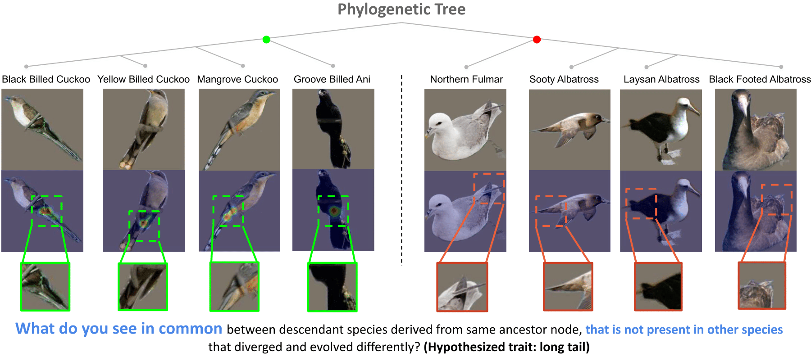

# HComP-Net: Hierarchy aligned Commonality through Prototypical Networks
This repository presents the PyTorch code for **HComP-Net** (**H**ierarchy aligned **Com**monality through **P**rototypical **Net**works) 

Paper: What Do You See in Common? Learning Hierarchical Prototypes over Tree-of-Life to Discover Evolutionary Traits

<!-- PIP-Net is an interpretable and intuitive deep learning method for image classification. PIP-Net learns prototypical parts: interpretable concepts visualized as image patches. PIP-Net classifies an image with a sparse scoring sheet where the presence of a prototypical part in an image adds evidence for a class. PIP-Net is globally interpretable since the set of learned prototypes shows the entire reasoning of the model. A smaller local explanation locates the relevant prototypes in a test image. The model can also abstain from a decision for out-of-distribution data by saying “I haven’t seen this before”. The model only uses image-level labels and does not rely on any part annotations.  -->

**HComP-Net** is an hierarchical interpretable image classification framework that can be applied to discover potential evolutionary traits from images by making use of the Phylogenetic tree also called as Tree-Of-Life. HComPNet generates hypothesis for potential evolutionary traits by learning semantically meaningful non-over-specific prototypes at each internal node of the hierarchy



## Setting up environment
Run the following command to create and activate a new conda environment
```
conda create -n hcomp
conda activate myenv
```
and run the following command to install the required packages
```
pip install -r requirements.txt
```

## Setting up datasets

### Downloading phylogeny

### Downloading datasets

### Downloading CUB meta files (for evaluations)

## Training HComP-Net
In order to train the model run the following command.
The following command is for running the model on ```cub190``` dataset. Running ```cub190``` with a ```batch_size``` of 256 required two a100 GPUs, therefore ```gpu_ids``` is set to ```0,1```. For running on single gpu remove the ```gpu_ids``` argument, as it assume single GPU by default.
```
python main.py --log_dir './runs/hcompnet_cub190_cnext26' --dataset CUB-190-imgnet-224 --net convnext_tiny_26 --batch_size 256 --batch_size_pretrain 256 --epochs 75 --epochs_pretrain 10 --epochs_finetune_classifier 3 --epochs_finetune_mask 60 --freeze_epochs 10 --gpu_ids '0,1' --num_workers 8 --phylo_config ./configs/cub190_phylogeny.yaml --num_protos_per_child 10
```
